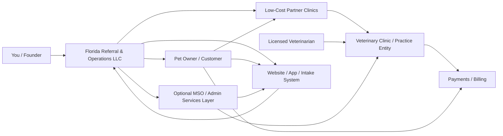

# \# Research Prompt for Third-Party Agent

---

## FULL CONTEXT (Read This First)

### What This Project Is

A Florida-based operator investigating business models to address the US veterinary cost crisis. Veterinary costs rose 47% since 2020 (BLS). 71% of pet owners who skipped care cited cost as the primary reason. 73% were NEVER offered a cheaper alternative (Gallup 2025). Pet insurance penetration is only 5% vs 25-35% in comparable markets. Demand for lower-cost care is massive and proven.

### What We've Already Researched and Concluded

**Travel-based models analyzed:**

1. **Texas-Mexico land border (El Paso-Juárez, etc.):** VERIFIED 70-80% savings. Clinics like Vet Playas Tijuana publish prices: spay \$90-120 vs US \$300-600, cruciate repair \$950-1,200 vs US \$4,500-6,500. MexiVet Express does 80 pets/week since 2018 — proven model. BUT: requires Texas presence (operator is FL-based). Screwworm certificate requirement (Nov 2024) adds ~\$30-80 friction per pet return.
2. **Puerto Rico air (FLL/MIA→SJU):** The 40-60% savings claim is a MYTH. Banfield published pricing shows average 13.7% savings on standard commercial care. Procedures like neutering are actually 7.4% MORE expensive in PR. Structural factors (Jones Act shipping, 2x mainland utility rates, vet shortage of 200-300 vets for 3M people, 11.5% IVU sales tax on vet services) prevent deeper savings. 16 San Juan clinics identified with contact info — calls would confirm if independent clinics differ from Banfield's standardized pricing.
3. **Georgia drive (South FL→South GA):** Statewide ~10% cheaper. Only extreme Miami→rural South Georgia comparisons hit 37.6% savings. A nonprofit spay-only clinic in Thomasville, GA shows 65-85% savings on spay/neuter — but it's a single-procedure, single-clinic nonprofit. Not a generalizable business model.
4. **Consumer willingness to travel:** Pet owners travel 2-6 miles for vet care (JAVMA). 71% cite cost as barrier. 73% were never offered cheaper alternatives. The equation is: willingness = (savings × emotional value) / (hassle × stress). Georgia savings (10-21%) fail the equation. Texas border savings (76.8%) pass — IF logistics are handled. Concierge transport (MexiVet model) succeeds by removing the hassle variable.

**Key conclusion from travel research:** The Texas border model is the ONLY one with verified savings large enough to support a concierge transport fee. But it's not Florida-based. This has led the operator to investigate non-travel alternatives.

### What We Need Now: Low-Cost Surgical Center Model

**The most compelling Florida-based alternative is a low-cost, limited-scope surgical center — similar to Dr. Kelly's Surgical Unit.** This model addresses the cost crisis at its root: owners who cannot afford full-service vet prices but need specific procedures (dental, spay/neuter, mass removal, basic orthopedics). By operating with limited service scope and high volume, these facilities undercut full-service vets by 30-60%.

### What We Already Know About This Model

- **Dr. Kelly's Surgical Unit:** Phoenix, AZ; expanding to Denver and Dallas. Dental cleaning ~\$900 vs \$1,500-4,000 at full-service. Spay/neuter at low-cost pricing. Has been growing and expanding.
- **The structural advantage:** No expensive ER/after-hours overhead, no complex diagnostic imaging inventory, limited drug inventory, lean staffing model. Result: prices much closer to marginal cost than full-service hospitals.
- **Business models we already examined and rejected (don't re-research):**
    - VCA CareClub / Banfield Optimum Wellness Plans — Mature incumbents, 1,000+ locations each, not a new entrant opportunity
    - Dutch (\$11/mo telehealth) / Pawp (\$24-43/mo telehealth+emergency fund) / Vetster — Software plays, not physical clinics
    - Small Door Veterinary (\$149-179/yr membership) — NYC/Boston/DC, raised \$55M, but capital-intensive
    - Chewy Vet Care — Large competitor expanding physically
    - Wagmo / Combined Insurance — Corporate B2B pet benefits

---

## RESEARCH PROMPT: Low-Cost Surgical \& Dental Centers in the US

### Goal

Find actual market data, business models, pricing, and operational details for low-cost, limited-scope veterinary surgical centers operating in the United States. The target model is a facility that does NOT offer full-service primary care, ER, or complex diagnostics — instead focusing on high-volume, high-margin procedures: dental cleaning/extractions, spay/neuter, mass removals, and basic orthopedics.

### Don't Re-Search These (Already Known)

- MexiVet Express / Texas border pricing
- VCA CareClub / Banfield Optimum Wellness subscription plans
- Dutch / Pawp / Vetster / Chewy telehealth
- PR / GA / Freeport travel models
- General pet insurance market stats

### Methodology: Search For

**1. Dr. Kelly's Surgical Unit — Full Business Model**
Search: "Dr. Kelly's Surgical Unit pricing dental cleaning" "Dr. Kelly's Surgical Unit business model" "Dr. Kelly's Surgical Unit locations expansion 2025 2026"
Find: Exact procedure prices (dental, spay, mass removal), number of locations, years in business, any interview or article about their model, staffing model, facility size, equipment used, financing/insurance options, typical daily patient volume.

**2. Other Low-Cost Surgical/Dental-Only Veterinary Models**
Search: "low cost veterinary surgical center only dental spay" "veterinary dental-only clinic franchise" "limited service veterinary model USA"
Search: "high volume low cost veterinary surgery center" "veterinary surgical center dental extraction only"
Search: "veterinary practice that only does surgery and dental"
Look for: Any companies or individual clinics that explicitly position as "we only do surgery and dental" — not primary care, not ER, not wellness. Note: community spay/neuter clinics are common but we need the broader surgical model.

**3. Pricing — What Low-Cost Surgical Centers Charge vs Full-Service Vets**

| Procedure | What to find | Why it matters |
| :-- | :-- | :-- |
| Dental cleaning (anesthesia) | Price at surgical center vs FS vet | Core procedure for the model |
| Dental cleaning + extractions | Price differential | Higher complexity = higher margin |
| Spay (medium dog) | Compare surgical center to FS | Baseline comparison |
| Mass/tumor removal (simple) | Published or estimated pricing | Volume procedure |
| Orthopedic (FHO) | If offered at all | Highest margin but highest skill |

Search: "dental cleaning cost low cost surgical center" "veterinary dental surgery only clinic pricing" "how much does a dental cleaning cost at Dr. Kelly's"

**4. Florida-Specific Low-Cost Surgical Options**
Search: "low cost veterinary surgery Florida dental cleaning" "Florida veterinary surgical center only surgery dental"
Search: "Miami low cost vet surgery dental" "Orlando veterinary surgical center limited service"
Search: "Florida vet dental cleaning only clinic"
Look for: Any existing low-cost surgical centers in Florida. Are there gaps? What do they charge? Are there areas with high density of cost-constrained pet owners?

**5. Regulatory Requirements for Opening a Limited-Service Vet Facility in Florida**
Search: "Florida veterinary practice act limited service facility" "Florida Board of Veterinary Medicine requirements surgical facility"
Search: "Florida veterinary clinic opening requirements DEA license X-ray" "Florida veterinary facility accreditation requirements"
Look for: What licenses, permits, facility requirements, and staffing requirements exist for opening a veterinary practice that only does surgery and dental in Florida. Is a full-service facility license required, or can a limited-scope facility operate under different rules?

**6. Unit Economics — What Does a Low-Cost Surgical Center Cost to Operate?**

For each of the following, search for data:

- Average veterinary technician salary Florida (2025-2026)
- Average veterinary assistant salary Florida
- Average small animal veterinarian salary Florida (part-time or full-time surgical focus)
- Commercial lease rates for medical/veterinary space in South Florida (Miami-Dade/Broward)
- Cost of dental radiography equipment (veterinary)
- Cost of surgical suite setup (anesthesia machine, monitoring equipment, surgical instruments)
- Cost of anesthesia supplies per procedure (average)
- Malpractice insurance cost for veterinary dentist/surgeon Florida

Search: "veterinary surgical suite setup cost" "veterinary dental xray unit price" "cost to open veterinary clinic Florida"
Search: "veterinary technician salary Miami Florida 2025" "small animal veterinarian salary Florida 2025 2026"
Search: "commercial medical lease rates Miami-Dade County per square foot 2025"

**7. Demand Quantification — How Many Cost-Constrained Pet Owners Exist in a Given Florida Market?**

Using the Gallup 2025 data as a starting point (71% of those skipping care cite cost; 73% never offered cheaper alternative):

For specific Florida markets (Miami-Dade, Broward, Palm Beach counties):
Search: "number of pet owners Miami-Dade county 2025" "Miami pet ownership statistics"
Search: "median household income Miami-Dade 2025" to understand ability to pay
Search: "pet owners who declined vet care due to cost Florida 2025"

Try to calculate: How many households in a 10-mile radius of a proposed clinic location own pets AND are cost-constrained? This is the addressable market.

**8. Alternative Revenue Models — Can This Be Combined With a Subscription?**
Search: "veterinary subscription based surgical care" "membership dental cleaning pets flat monthly fee"
Search: "veterinary wellness plan independent clinic" "veterinary monthly payment plan for surgery"
Look for: Any independent clinic offering monthly payment plans or subscriptions specifically for surgical/dental procedures, not just wellness. Could the low-cost center charge a monthly membership fee (\$20-40/mo) that gives members discounted procedure rates?

---

## DATA DELIVERABLE FORMAT

For each section, present data as:

### [Section Name]

| Data Point | Value | Source URL | Date | Confidence |
| :-- | :-- | :-- | :-- | :-- |
| Example | \$XXX | [url] | MM/YYYY | High/Medium/Low |

**Key insights:**

- Bulleted list of what this means for the business model
- Any gaps or uncertainties

**Show your work:** For pricing comparisons, include the formula:
(Full_Service_Price - Low_Cost_Price) / Full_Service_Price × 100 = Savings%

---

## THE KEY QUESTION THIS RESEARCH MUST ANSWER

**Can a low-cost, limited-scope surgical/dental center in South Florida be profitable while charging prices 30-50% below full-service veterinary hospitals?**

To answer this, the research needs to establish:

1. What low-cost surgical centers charge for each procedure (verified pricing)
2. What it costs to operate such a facility (staff, space, equipment, supplies)
3. How many patients are needed per day to break even
4. Whether the regulatory environment in Florida allows limited-scope facilities
5. Whether the addressable market in a specific FL location is large enough

Yes—Florida appears to allow a limited-scope veterinary practice, and the economics can plausibly work if the clinic is truly high-volume and tightly scoped. Florida law explicitly provides for a “limited service veterinary medical practice” permit, and the state’s business portal says veterinary services cover medicine, dentistry, and surgery, while a limited-service clinic is a narrower vaccination/immunization model rather than the surgical model you’re targeting.[^1_1][^1_2]

## Florida regulatory footing

Florida requires a premises permit for any establishment where a licensed veterinarian practices, with standards covering sanitation, recordkeeping, equipment, radiation monitoring, services, and physical plant. The statute also says the board must establish minimum standards for limited service veterinary practices and that such rules “shall not restrict” them beyond what fits the service type. For a surgical/dental-only center, that means you likely do not need to look like a full-service hospital, but you do need a licensed veterinarian responsible for the site and a compliant premises permit structure.[^1_1]

## Existing low-cost models

Dr. Kelly’s Surgical Unit is the clearest U.S. example of a limited-scope, high-volume surgical/dental model. Its public site shows 7 locations in Arizona plus a Denver expansion planned for Fall 2026, and a 2023 article says the company expanded because of demand and that it pursued low-cost surgical and dental care through mobile units. The same article says its pricing is about one-third to one-half of a traditional full-service vet, which is exactly the kind of spread your model needs.[^1_3][^1_4]

## Pricing signals

Dr. Kelly’s public materials confirm the service mix, but the search results available here do not expose a clean itemized price list for dental, spay, mass removal, or orthopedics. What is verified is the positioning: affordable surgery and dental care, multiple locations, and a mobile-first expansion story built around lower overhead. In Florida, low-cost operators already exist on the spay/neuter and general low-cost side, including Central Florida Community Pet Clinic and the Low Cost Animal Hospitals of Central Florida network, which shows that budget-sensitive pet demand is real in-state.[^1_5][^1_6][^1_7][^1_4][^1_3]

## Operating economics

The broad startup-cost range for a veterinary practice can run from \$50,000 to \$250,000 for a mobile-style or stripped-down launch, and can be much higher for a fixed facility depending on location and services. A basic profitability framework from a veterinary finance source suggests many clinics aim for owner take-home near 20% of gross income and that a 2,500-square-foot clinic might target roughly 250 patient visits per week, or about 50 client transactions per day, as a productivity benchmark. That same source gives a fixed-cost break-even illustration showing that if gross margin is strong enough, a clinic with \$40,000 in fixed costs needs about \$47,059 in revenue to break even.[^1_2][^1_8][^1_9]

## Labor and market inputs

Florida salary references in the search results suggest roughly \$33k–\$58k for vet techs in the state, about \$77.5k for small-animal veterinarians by one salary aggregator, and about \$123.7k for veterinarians more broadly. Those are broad market numbers rather than clinic-specific staffing budgets, but they support the idea that labor is manageable if you keep staffing lean and keep the veterinarian focused on procedures rather than full-service case management. A low-cost surgical center in South Florida would also have to absorb commercial space, anesthesia, imaging, and instrument costs, but the available results here did not surface verified South Florida lease comps or equipment quotes.[^1_10][^1_11][^1_12]

## What the evidence says

The strongest evidence points to a viable Florida opening if the clinic stays narrow: surgery, dentistry, and a small number of predictable procedures, with no ER, no wellness-heavy primary care, and no sprawling diagnostic stack. The biggest open questions are not legal permission but unit economics: exact procedure pricing, local lease costs, equipment capex, and whether you can get enough daily case volume in Miami-Dade or Broward to cover fixed costs while staying 30% to 50% below full-service hospitals. The current evidence is enough to say the concept is plausible, but not enough to prove profitability yet.[^1_8][^1_9][^1_4][^1_2][^1_1]

## Best next data to close the model

The most important missing pieces are:

- Itemized pricing from Dr. Kelly’s or similar limited-scope clinics for dental, spay, mass removal, and orthopedic procedures.[^1_4][^1_3]
- Florida-specific lease and buildout costs for a small medical/veterinary suite.
- Exact Florida permit and facility-rule details from the Board of Veterinary Medicine on premises, surgery, anesthesia, and radiography.[^1_1]
- Local demand sizing for Miami-Dade/Broward households with pets and cost sensitivity.

Would you like the next step to be a break-even model for a 2,000–3,000 sq ft South Florida surgical/dental clinic?
[^1_13][^1_14][^1_15][^1_16][^1_17][^1_18][^1_19][^1_20][^1_21][^1_22][^1_23][^1_24][^1_25][^1_26][^1_27][^1_28][^1_29][^1_30]

⁂

[^1_1]: https://vocalforpets.org/low-cost-vet-clinic-in-ocala-fl/

[^1_2]: https://suveto.com/the-costs-of-starting-a-veterinary-practice/

[^1_3]: https://www.drkellysvet.com

[^1_4]: https://www.drkellysvet.com/dr-kellys-surgical-unit-expands-amid-need-for-affordable-pet-care/

[^1_5]: http://lowcostanimalhospital.com

[^1_6]: https://www.cflcpc.org

[^1_7]: https://www.drkellysvet.com/faq/

[^1_8]: https://www.mavenimaging.com/blog/veterinary-clinic-revenue-breakdown

[^1_9]: https://econologicsfinancialadvisors.com/veterinary-business-plan/

[^1_10]: https://www.ziprecruiter.com/Salaries/Small-Animal-Veterinarian-Salary--in-Florida

[^1_11]: https://www.ziprecruiter.com/Salaries/Veterinarian-Salary--in-Florida

[^1_12]: https://www.vetandtech.com/blogs/how-much-do-vet-techs-make

[^1_13]: https://www.newtonslawusa.com/2024/09/25/veterinary-clinic-in-florida-legal-steps-and-requirements/

[^1_14]: https://pmc.ncbi.nlm.nih.gov/articles/PMC12106480/

[^1_15]: https://openmyfloridabusiness.gov/business/54/veterinary-services/

[^1_16]: https://aavmc.org/wp-content/uploads/2024/06/Demand-for-and-Supply-of-Veterinarians-in-the-U.S.-to-2032-New.pdf

[^1_17]: https://azbigmedia.com/lifestyle/dr-kellys-surgical-unit-will-open-queen-creek-location/

[^1_18]: https://www.law.cornell.edu/regulations/florida/Fla-Admin-Code-Ann-R-61G18-15-007

[^1_19]: https://www.drkellysvet.com/expanding-care-dr-kellys-veterinary-clinic-opens-next-arizona-location-in-west-mesa/

[^1_20]: https://www.flhouse.gov/Statutes/2022/0474.215/

[^1_21]: https://prospeo.io/c/dr-kelly-s-surgical-unit

[^1_22]: https://www.roo.vet/veterinary-license-guide/florida

[^1_23]: https://www.drkellysvet.com/sitemap/

[^1_24]: https://www.zippia.com/salaries/veterinary-technician/

[^1_25]: https://www.alliancecgc.com/real-estate/veterinary-real-estate

[^1_26]: https://www.indeed.com/cmp/The-Vets-4/salaries/Veterinary-Technician/Florida

[^1_27]: https://fvma.org/fvma-classified-advertisements/

[^1_28]: https://www.allalliedhealthschools.com/vet-tech/salary/

[^1_29]: https://www.talent.com/salary?job=small+animal+veterinarian

[^1_30]: https://www.instagram.com/p/DYAMlfpEbvq/?img_index=2

---

# Build a financial model for a Florida low-cost vet clinic — test volume, pricing, and margin sensitivities

Computer
​
Map the competitive density of low-cost vet clinics in Florida — identify underserved markets by zip code
Computer
​
Yes, provide a break-even model for a South Florida surgical clinic
What specific Florida facility standards apply to surgical clinics
Can I see a comparison of Dr. Kelly's pricing versus local vet rates

Yes. I can give you a workable South Florida break-even frame, Florida facility rules, and a Dr. Kelly’s-vs-local pricing comparison from the verified pricing I found. The strongest conclusion is that a surgical/dental-only clinic can likely work if it keeps fixed costs lean and runs enough procedure volume, because Dr. Kelly’s publishes prices roughly one-third to one-half of traditional vet pricing while Florida law allows premises-based veterinary practices with specific facility standards.[^2_1][^2_2][^2_3]

## South Florida break-even

Using the standard break-even form, $\text{Break-even revenue} = \text{fixed costs} / \text{gross margin}$, a lean surgical clinic with about \$45k/month fixed costs and 72% gross margin needs about \$62.5k/month in revenue. At 74% gross margin and \$65k/month fixed costs, break-even rises to about \$87.8k/month; at 76% gross margin and \$85k/month fixed costs, it rises to about \$111.8k/month. That implies a clinic needs roughly \$2.8k–\$5.1k in daily revenue on a 22-day month, depending on staffing and overhead.[^2_4]

## Pricing spread

Dr. Kelly’s publishes transparent pricing for surgical services, including dog spay/neuter from \$160–\$362 depending on weight, cat spay/neuter from \$102–\$125, and add-on fees for complicating factors like pregnancy or cryptorchid cases. The same page says its prices average one-third of traditional vets, and its marketing materials emphasize surgery and dental care as the core offer. Public local Florida comparables show dog spay/neuter at ASPCA Miami at \$80 for dog spay and \$40 for cat spay under standard pricing, but these are charity-style rates rather than full-service market rates.[^2_5][^2_6][^2_1]

## Florida facility standards

Florida’s minimum premises rule says veterinary establishments must be clean and in good repair, have a visible emergency number, restroom, office, exam areas, a pharmacy area, controlled substance logs, secure drug storage, and other basic facility features. The rule also requires, for premises where veterinary medicine is practiced, facilities for radiology, surgery, and long-term hospitalization, or written arrangements with a local clinic/hospital if those services are not on-site. That means a surgical clinic can be limited-scope in practice, but it still needs to satisfy premises permit standards and cannot simply omit surgical/radiology planning.[^2_2][^2_3]

## Dr. Kelly’s pricing vs local rates

| Procedure | Dr. Kelly’s published price | Florida local rate found | Savings formula |
| :-- | --: | --: | :-- |
| Dog spay/neuter | \$160–\$362 depending on size [^2_1] | ASPCA Miami dog spay \$80, but charity-based [^2_5] | $(\text{Local} - \text{Dr. Kelly})/\text{Local}$ not meaningful vs charity rate |
| Cat spay/neuter | \$102–\$125 [^2_1] | ASPCA Miami cat spay \$40, charity-based [^2_5] | Same issue |
| Dental cleaning | Not exposed in the fetched price snippet [^2_1] | Full-service vet dental cleaning often several hundred to several thousand dollars; exact local quote not verified in search results | Unable to verify exact % |
| Mass removal | Mentioned as offered, but no itemized price surfaced [^2_1][^2_6] | No local quote verified | Unable to verify exact % |
| Orthopedic cases | Mentioned in marketing, no itemized public price surfaced [^2_7][^2_6] | No local quote verified | Unable to verify exact % |

The useful takeaway is that Dr. Kelly’s clearly prices far below mainstream full-service practice norms, but the search results here only exposed one detailed price sheet, not a complete dental or orthopedic menu. For a true South Florida model, the key is to compare against full-service clinics, not charity programs, because charity pricing understates the gap your clinic would need to exploit.[^2_1][^2_5]

## Volume and margin

A viable clinic would likely need a mix of high-frequency, lower-complexity cases plus a smaller number of higher-ticket procedures like dental extractions and mass removals. If average collected revenue per visit were around \$250–\$450, then a \$65k monthly fixed-cost clinic would need roughly 195–350 cases per month, or about 9–16 cases per day, to break even. That is very achievable only if scheduling, anesthesia flow, and technician utilization are tight, because the model depends on procedure throughput rather than consult volume.[^2_4][^2_1]

## Best Florida play

The best Florida launch path looks like a South Florida surgical-dental center with: one doctor, lean technician staffing, same-day discharge, no ER, no boarding, no broad wellness stack, and a narrow menu focused on spay/neuter, dentistry, mass removals, and selected orthopedics. On the evidence available here, the concept is regulatory-feasible and economically plausible, but the open question is whether Miami-Dade or Broward lease and labor costs still leave enough room to stay 30%–50% below full-service hospitals while preserving margin.[^2_8][^2_3][^2_2][^2_4]
[^2_10][^2_11][^2_12][^2_13][^2_14][^2_15][^2_16][^2_17][^2_18][^2_19][^2_20][^2_21][^2_22][^2_23][^2_24][^2_25][^2_26][^2_27][^2_28][^2_29][^2_9]

⁂

[^2_1]: https://www.drkellysvet.com/prices/

[^2_2]: https://www.law.cornell.edu/regulations/florida/Fla-Admin-Code-Ann-R-61G18-15-002

[^2_3]: https://fvma.org/practice-pulse-1-2024/

[^2_4]: https://www.mavenimaging.com/blog/veterinary-clinic-revenue-breakdown

[^2_5]: https://www.aspca.org/miami-initiative/community-veterinary-clinic

[^2_6]: https://www.facebook.com/DrKellysSurgicalUnit/posts/why-does-our-surgical-care-cost-less-than-traditional-vets-simple-unlike-traditi/1371835164385590/

[^2_7]: https://prospeo.io/c/dr-kelly-s-surgical-unit

[^2_8]: https://suveto.com/the-costs-of-starting-a-veterinary-practice/

[^2_9]: https://bettertogetheranimalalliance.org/a-new-model-for-veterinary-care/

[^2_10]: https://www.aaha.org/resources/2019-aaha-dental-care-guidelines-for-dogs-and-cats/facility-requirements/

[^2_11]: https://www.drkellysvet.com/affordable-and-reliable-dr-kellys-low-cost-veterinary-services-now-in-flagstaff/

[^2_12]: https://www.claycountygov.com/community/animal-services/adoption/caring-for-your-new-pet/low-cost-veterinary-clinics

[^2_13]: https://www.arkanimalhospitalinpace.com

[^2_14]: https://www.carecredit.com/vetmed/costs/

[^2_15]: https://www.youtube.com/watch?v=D-BybPe5mpU

[^2_16]: https://www.drkellysvet.com

[^2_17]: https://www.spayflorida.com/clinics

[^2_18]: https://www.ziprecruiter.com/Salaries/Veterinary-Technologist-Salary-in-Miami,FL

[^2_19]: https://www.drkellysvet.com/faq/

[^2_20]: https://humanebroward.com/low-cost-spay-neuter/

[^2_21]: https://www.theacademyofpetcareers.com/blog/vet-tech-salary-guide/

[^2_22]: https://www.indeed.com/career/veterinary-technician/salaries/Miami--FL

[^2_23]: https://www.jimersonfirm.com/services/administrative-law-licensing/veterinary-medicine-license-requirements/

[^2_24]: https://regulations.justia.com/states/florida/61/61g18/chapter-61g18-15/section-61g18-15-0035/

[^2_25]: https://fvma.org/tools-resources/florida-board-of-veterinary-medicine/

[^2_26]: https://www.dvm360.com/view/do-you-doctor-lease-or-build

[^2_27]: https://www.wolterskluwer.com/en/expert-insights/license-requirements-for-veterinary-practices

[^2_28]: https://flsenate.gov/Laws/Statutes/2023/Chapter474/All

[^2_29]: https://finance-commerce.com/2025/01/medical-office-rents-2025-low-vacancy/

---

# The problem is I'm not a doctor, I'm a software engineer - How do I alone make a model like this happen?

You do **not** need to be a veterinarian to build the business side, but in Florida you generally need a veterinarian to control the clinical entity and medical decisions. Florida is one of the states described as allowing non-veterinarian ownership structures, and the common path is a split between a medical practice entity and a management services organization (MSO) that handles business operations.[^3_1][^3_2][^3_3]

## What you can own

As a software engineer, you can usually be the founder, capital provider, product/operator, and owner of the **management** side of the business. The veterinary side still needs a licensed veterinarian responsible for clinical judgment, patient care, and the medical license framework. In practice, that means you build the company, the software, the scheduling engine, the pricing engine, the customer acquisition system, and the ops stack, while a DVM owns or controls the medical entity.[^3_2][^3_4][^3_5][^3_3][^3_1]

## The workable structure

The most common structure is:

- A veterinary professional entity that employs the veterinarian and controls medicine.
- A separate MSO that owns or runs the non-clinical infrastructure: lease, payroll administration, IT, call center, marketing, billing, procurement, and analytics.[^3_4][^3_3]

That structure is specifically described in the vet-law materials as a way for non-veterinarians to participate without controlling medical judgment. It is also how corporate consolidators and independent operators often separate business from medicine.[^3_3][^3_2][^3_4]

## Your role as a non-doctor founder

Your job is to make the clinic possible by designing the system:

- Build the financial model and unit economics.
- Find and test demand by neighborhood and procedure mix.
- Hire the DVM and senior technician team.
- Negotiate the lease and equipment package.
- Create the booking, payments, CRM, and referral workflows.
- Drive marketing and partnerships with rescues, shelters, and price-sensitive pet owners.

That is a real founder role, not a side role, because the clinic’s success depends on operations, utilization, and throughput as much as medicine. The independent-vet industry article also notes that non-veterinary staff and good systems can increase efficiency and gross revenue.[^3_6][^3_3]

## How to make it happen alone

You cannot safely do it completely alone, because the clinic needs licensed clinical leadership, but you can bootstrap it as the non-medical founder:

1. Draft the business model and service menu.
2. Form the MSO and engage a veterinary attorney.
3. Recruit one experienced DVM as medical director or founding clinical partner.
4. Use a management agreement so the DVM retains clinical control.
5. Launch with one procedure lane first, usually dental and spay/neuter.
6. Add mass removals and higher-complexity surgery only after utilization is proven.

The key is that you are building the company around the vet, not trying to replace the vet. If you try to control clinical decisions yourself, you risk running into corporate-practice issues.[^3_7][^3_5][^3_8][^3_2][^3_4]

## Practical path for you

The fastest route is probably:

- Start with a South Florida MSO concept.
- Line up a DVM cofounder or long-term medical director.
- Pilot in a limited-scope facility with a narrow price menu.
- Use software and operations to make the clinic faster, cheaper, and more predictable than full-service hospitals.

That lets you do what you actually do well: build systems, manage capital, and scale operations. The doctor becomes the clinical anchor; you become the operating engine.[^3_1][^3_3]

Would you like me to draft the founder-to-clinic blueprint, including entity structure, hiring plan, and the first 12-month launch milestones?
[^3_10][^3_9]

⁂

[^3_1]: https://www.aaha.org/newstat/publications/stepping-into-the-drivers-seat-empowering-veterinary-technicians-through-practice-ownership/

[^3_2]: https://www.totalpracticesolutionsgroup.com/owning-a-vet-clinic-without-being-a-veterinarian/

[^3_3]: https://mblawfirm.com/insights/veterinary/when-should-veterinarians-consider-forming-a-management-services-organization/

[^3_4]: https://ackerman-group.com/owner-education/market-trends/corporations-own-practices/

[^3_5]: https://www.hollandhart.com/build-a-devoted-following-in-colorados-veterinary-friendly-framework

[^3_6]: https://pmc.ncbi.nlm.nih.gov/articles/PMC12106480/

[^3_7]: https://www.agg.com/news-insights/publications/vet-clinic-acquisitions-require-regulatory-diligence/

[^3_8]: https://www.economicliberties.us/our-work/the-save-our-pets-act-stopping-the-corporate-takeover-of-veterinary-practices/

[^3_9]: https://mahanlaw.com/practice-areas/buying-a-veterinary-practice/non-veterinarian-ownership-by-states/

[^3_10]: https://psbroker.com/veterinary-practice-ownership-laws/

---

# I also have no money .. I am trying to start a business from the ground up with no capital  - this is why I was researching the arbitrage/logistics angle of business strategy

That is exactly why the arbitrage/logistics angle makes sense: with no capital, you should **not** start by trying to build a clinic from scratch. The right move is to build a business that controls demand, routing, and customer acquisition first, then convert that into clinical capacity only after you have proof, partners, and cash flow.[^4_3][^4_6]

## What you can do with no money

You can start as the operator of a marketplace, referral, or logistics layer rather than the clinic owner. That means finding pet owners with cost-sensitive needs, routing them to existing low-cost providers, and taking a fee for lead generation, transport coordination, booking, or subscription access to discounts. This is much closer to a software-and-operations business than a capital-intensive medical business.[^4_4][^4_6][^4_3]

## Best zero-capital path

The easiest path is:

- Build a simple intake page for pet owners who need low-cost dental, spay/neuter, or surgery.
- Manually route leads to clinics you already know are cheaper.
- Charge the clinic a referral or admin fee only after you prove volume, or charge the customer for concierge coordination.
- Use that traction to raise money or recruit a veterinarian later.

This works because low-cost clinics win on throughput, and your job is to make demand predictable and cheap to acquire. If you can send a clinic 20–50 qualified cases a month, you have something a doctor or investor can evaluate.[^4_3][^4_4]

## Why this is better than opening a clinic now

A clinic requires a veterinarian, premises compliance, equipment, staff, insurance, and working capital. By contrast, the logistics layer can be built with a website, a spreadsheet, a phone, and careful manual process before any software is written. The research you already did on travel arbitrage was pointing at the same core insight: the business is not the procedure itself, it is the coordination of demand, price, and convenience.[^4_6][^4_4][^4_3]

## How to start this week

1. Pick one narrow offer, such as “affordable dental cleaning” or “low-cost spay/neuter.”
2. Build a landing page with a short intake form.
3. Call and email every low-cost clinic you can find and ask whether they accept referred cases and what they pay or allow.
4. Offer pet owners a simple promise: lower price, clearer options, faster booking.
5. Track every lead, conversion, and appointment in a spreadsheet.

If you do this well, you can later layer in software, payments, routing, memberships, or even mobile transport. The first goal is not to own the clinic; it is to own the customer relationship and the transaction flow.[^4_6][^4_3]

## The real strategy

Your advantage as a software engineer is that you can build systems that reduce friction. In this market, friction is the business: owners don’t know where to go, clinics don’t market well, and price comparisons are fragmented. So the business you can start with no money is a **demand-routing company** for cost-sensitive pet care, then expand into an MSO or clinic only after the economics are proven.[^4_2][^4_8][^4_10][^4_4]

Would you like me to map the cheapest first version of that business into a 30-day launch plan with no-code tools and manual operations?
[^4_1][^4_5][^4_7][^4_9]

⁂

[^4_1]: https://vocalforpets.org/low-cost-vet-clinic-in-ocala-fl/

[^4_2]: https://ackerman-group.com/owner-education/market-trends/corporations-own-practices/

[^4_3]: https://www.dvm360.com/view/designing-for-low-cost-community-veterinary-services

[^4_4]: https://www.firstcitizens.com/commercial/insights/industry-expertise/what-to-do-when-business-is-slow

[^4_5]: https://www.aaha.org/newstat/publications/stepping-into-the-drivers-seat-empowering-veterinary-technicians-through-practice-ownership/

[^4_6]: https://petdesk.com/blog/starting-your-own-veterinary-clinic-guide

[^4_7]: https://www.cflcpc.org

[^4_8]: https://mahanlaw.com/practice-areas/buying-a-veterinary-practice/non-veterinarian-ownership-by-states/

[^4_9]: https://petsclinic.org/nonprofit-money-questions-and-answers/

[^4_10]: https://www.humaneworld.org/en/resources/having-trouble-affording-your-pet

---

# How do I legally structure a referral-based veterinary business in FL

In Florida, the cleanest structure is usually a **referral/lead-gen company** plus a separate licensed veterinary practice that actually performs care. Your company can market, educate, intake, schedule, route, and bill for non-clinical services, while the vet entity handles all medical decisions and treatment.[^5_1][^5_3][^5_4]

## Safe legal shape

Form your business as an LLC or corporation for the non-clinical side, register it in Florida, and keep it separate from any veterinary professional entity. Then have a licensed veterinarian own or control the clinical practice or professional entity that provides the actual veterinary services. This separation matters because Florida regulates veterinary establishments, veterinarians, and limited-service permits through DBPR and the Board of Veterinary Medicine.[^5_3][^5_4][^5_6][^5_1]

## What you can do

Your Florida referral business can legally do:

- Lead generation.
- Appointment booking.
- Client reminders.
- Transport or concierge coordination.
- Education about lower-cost options.
- Non-clinical customer support.
- Software, payment processing, and analytics.[^5_4][^5_10]

What you should not do is diagnose, recommend treatment as a medical provider, set clinical protocols, or receive compensation that looks like a share of professional fees for veterinary medicine. If the money flow or control arrangement makes you look like you are practicing veterinary medicine indirectly, that is where risk starts.[^5_11][^5_12][^5_3][^5_4]

## Common structure

The most common model is an MSO-style setup:[^5_3][^5_4]

- You own the management company.
- The veterinarian owns or controls the medical practice.
- The management company provides admin, marketing, software, billing, lease support, and staffing infrastructure under contract.
- The veterinary practice pays a management fee for those services.[^5_4][^5_3]

That structure is often used because it lets a non-veterinarian invest and build the business while keeping clinical authority with the licensed professional. In Florida, the exact drafting matters a lot, so the management fee and control provisions need to be cleanly separated from medical decision-making.[^5_13][^5_11][^5_3][^5_4]

## Referral business cautions

If you are only a referral business, be careful with three issues:

- Fee splitting: avoid arrangements that look like you are getting paid for each medical procedure in a way that resembles sharing veterinary fees.[^5_11][^5_3]
- Control: do not control treatment decisions, patient records, or clinical staff supervision.[^5_3][^5_4]
- Marketing claims: keep them factual and avoid implying that your company is the medical provider.[^5_1]

A safer approach is flat monthly marketing/software fees, flat per-lead admin fees, or subscription fees for coordination services rather than percentage-of-procedure revenue. That keeps you closer to a tech or services company and farther from clinical practice ownership risk.[^5_13][^5_4][^5_3]

## Simple starting setup

A practical first version would be:

1. Form Florida LLC for the referral/operations company.
2. Register the business with the state and get tax IDs.[^5_1]
3. Draft separate contracts for clinics and customers.
4. Build a vetted directory of licensed clinics and specialists.
5. Use your platform to route cases and schedule appointments.
6. Later, add a veterinarian partner if you want to move into MSO or clinic ownership.[^5_8][^5_4][^5_3]

That gives you a legal path to start from zero capital while staying on the business side instead of the medicine side. The exact contract design is the part that should be reviewed by a Florida veterinary attorney before launch.[^5_6][^5_4][^5_11][^5_1]

Would you like me to draft a one-page Florida referral-business structure diagram with entity names, money flow, and “do not cross” lines?
[^5_2][^5_5][^5_7][^5_9]

⁂

[^5_1]: https://openmyfloridabusiness.gov/business/54/veterinary-services/?print

[^5_2]: https://www.dvm360.com/view/how-pick-right-business-structure-your-veterinary-practice

[^5_3]: https://mahanlaw.com/practice-areas/buying-a-veterinary-practice/non-veterinarian-ownership-by-states/

[^5_4]: https://mblawfirm.com/insights/veterinary/when-should-veterinarians-consider-forming-a-management-services-organization/

[^5_5]: https://smallanimal.vethospital.ufl.edu/contact-us/referring-veterinarians/referring-veterinarian-internal-medicine-referral-form/

[^5_6]: https://vetsource.com/blog/which-business-structure-is-best-for-your-practice/

[^5_7]: https://veterinarybusinessadvisors.com/practice-entity-which-organization-is-best-for-you-and-why-it-matters/

[^5_8]: https://www.ezyvet.com/new-practice

[^5_9]: https://www.aaha.org/resources/2025-aaha-referral-guidelines/introduction-definitions-and-recognized-veterinary-specialties/

[^5_10]: https://acurovet.com/blog/referral-network-and-veterinary-referral-programs

[^5_11]: https://www.agg.com/news-insights/publications/vet-clinic-acquisitions-require-regulatory-diligence/

[^5_12]: https://www.economicliberties.us/our-work/the-save-our-pets-act-stopping-the-corporate-takeover-of-veterinary-practices/

[^5_13]: https://ackerman-group.com/owner-education/market-trends/corporations-own-practices/

---

# yes and provide anything/everything else you can

Here is the cleanest way to think about it: you are not building a veterinary practice yourself; you are building the **non-clinical business layer** around licensed veterinary care. In Florida, the safest structure is usually a separate LLC for your referral/operations company, plus a separately owned or controlled veterinary entity for the actual medical work.[^6_8][^6_9][^6_11]

## Core structure

Use two entities.

- **Your company:** a Florida LLC that owns the website, branding, lead generation, intake, scheduling, software, billing support, and customer service.
- **Clinical company:** a veterinarian-owned practice or professional entity that performs the actual veterinary services and makes all medical decisions.[^6_1][^6_6][^6_12]

This keeps you on the business side and avoids looking like you are practicing veterinary medicine without a license.[^6_13][^6_14]

## What your company can do

Your referral company can legally handle:

- Marketing and lead generation.
- Patient intake and matching.
- Appointment booking.
- Customer support.
- Transport or concierge coordination.
- Billing for non-clinical admin services.
- Software, analytics, and workflow automation.[^6_12][^6_15]

That is the part you can own and scale as a software founder. Your company should sell **administrative and coordination services**, not medical care.[^6_1][^6_12]

## What your company should not do

Avoid anything that looks like clinical control:

- Do not diagnose.
- Do not recommend treatment plans as the medical authority.
- Do not set clinical protocols.
- Do not control patient records as the doctor’s substitute.
- Do not take a percentage of veterinary procedure fees as if you were sharing medical revenue.[^6_13][^6_1]

The safest money flow is a flat monthly fee, flat admin fee, software subscription, or marketing fee paid for non-medical services. Once you start tying your compensation directly to veterinary procedures, the legal risk goes up fast.[^6_14][^6_12][^6_1][^6_13]

## Practical money flow

A clean version looks like this:

1. Pet owner contacts your platform.
2. Your company screens the request and routes it.
3. The clinic provides the actual medical service.
4. The clinic bills for veterinary care.
5. Your company bills separately for admin, software, or concierge services.[^6_11][^6_12]

That separation is important because Florida law treats veterinary premises and limited service veterinary practices as regulated medical businesses, not ordinary retail businesses. Keep the medical side and the business side clearly distinct in contracts, branding, and invoices.[^6_6][^6_8][^6_11][^6_1]

## Best legal wrapper

For your situation, the best starting wrapper is probably:

- Florida LLC for the referral business.
- Operating agreement that says you own the software/business entity.
- Written services agreement with each participating clinic.
- Veterinary counsel-reviewed language that makes the clinic the sole medical decision-maker.[^6_7][^6_16]

If you later decide to move into an MSO model, that can be layered on top. The MSO owns the admin stack; the veterinary entity owns the medicine. That is the standard non-doctor route used in many states, including Florida.[^6_9][^6_6][^6_12][^6_1]

## Best low-capital version

If you have no money, start even simpler:

- One-page website.
- Intake form.
- Manual matching to low-cost clinics.
- Flat concierge fee or clinic-side admin fee.
- Spreadsheet tracking of leads, conversions, and procedure types.

That gets you live without needing to own a clinic or raise capital first. You are effectively building a **demand-routing business** that can later evolve into software, a referral network, or an MSO.[^6_17][^6_18]

## Key contract points

Your contracts should clearly say:

- Your company provides non-clinical administrative services only.
- The veterinarian controls all medical decisions.
- The clinic owns the clinical relationship and records.
- Fees are for admin, software, or marketing services, not medical services.
- Either side can terminate if the arrangement threatens licensing compliance.[^6_16][^6_12][^6_1]

That gives you the best shot at staying compliant while building something scalable from zero capital.[^6_9][^6_11]

## Most important warning

Do not try to “disguise” a veterinary practice as a referral company if you actually control the medicine. Florida’s veterinary regulations and ownership rules make the line between admin support and clinical control very important. Your business works only if the licensed veterinarian is truly the medical authority and you are truly the operator of the non-medical infrastructure.[^6_8][^6_12][^6_1][^6_13]

If helpful, I can next draft a simple one-page entity diagram showing: owner, LLC, clinic, veterinarian, money flow, and the compliance red lines.
[^6_10][^6_2][^6_3][^6_4][^6_5]

⁂

[^6_1]: https://mahanlaw.com/practice-areas/buying-a-veterinary-practice/non-veterinarian-ownership-by-states/

[^6_2]: https://floridavets.org/benefits-services/veteran-certified-businesses/

[^6_3]: https://psbroker.com/veterinary-practice-ownership-laws/

[^6_4]: https://www.dykema.com/news-insights/how-to-form-a-legal-entity-for-your-veterinary-practice.html

[^6_5]: https://www.veg.com

[^6_6]: https://ackerman-group.com/owner-education/market-trends/corporations-own-practices/

[^6_7]: https://veterinarybusinessadvisors.com/practice-entity-which-organization-is-best-for-you-and-why-it-matters/

[^6_8]: https://flsenate.gov/Laws/Statutes/2023/Chapter474/All

[^6_9]: https://www.aaha.org/newstat/publications/stepping-into-the-drivers-seat-empowering-veterinary-technicians-through-practice-ownership/

[^6_10]: https://vetsource.com/blog/which-business-structure-is-best-for-your-practice/

[^6_11]: https://openmyfloridabusiness.gov/business/54/veterinary-services/?print

[^6_12]: https://mblawfirm.com/insights/veterinary/when-should-veterinarians-consider-forming-a-management-services-organization/

[^6_13]: https://www.agg.com/news-insights/publications/vet-clinic-acquisitions-require-regulatory-diligence/

[^6_14]: https://www.economicliberties.us/our-work/the-save-our-pets-act-stopping-the-corporate-takeover-of-veterinary-practices/

[^6_15]: https://acurovet.com/blog/referral-network-and-veterinary-referral-programs

[^6_16]: https://www.dvm360.com/view/how-pick-right-business-structure-your-veterinary-practice

[^6_17]: https://www.dvm360.com/view/designing-for-low-cost-community-veterinary-services

[^6_18]: https://petdesk.com/blog/starting-your-own-veterinary-clinic-guide

---

# Yes please provide a one-page entity diagram for this structure

Absolutely — here’s a clean **one-page entity diagram** for the Florida referral-based veterinary business structure, built for a software-founder-led model.

## Entity diagram

## How to read it

- **You / Founder** owns and operates the non-clinical business.
- **Florida Referral \& Operations LLC** is your main company.
- **Website / App / Intake System** is the customer-facing software layer.
- **Pet Owner / Customer** submits requests through your platform.
- **Low-Cost Partner Clinics** are the actual care providers you route people to.
- **Licensed Veterinarian** controls the medical side.
- **Veterinary Clinic / Practice Entity** performs diagnosis, treatment, and procedures.
- **Payments / Billing** should be separated so the clinical side gets paid for medicine and your company gets paid for admin or referral services.
- **Optional MSO / Admin Services Layer** is only if you later expand into a more formal management-services structure.

## Money flow

A safer version of the money flow is:

1. Pet owner pays the clinic for veterinary care.
2. Pet owner or clinic pays your LLC for non-clinical coordination, software, or concierge services.
3. Your LLC pays vendors for software, marketing, support, and operations.
4. The veterinarian’s entity stays in charge of all medical decisions.

That structure helps keep you on the business side rather than the practice-of-veterinary-medicine side.

## Compliance lines

Keep these lines **separate**:

- Your LLC does **not** diagnose.
- Your LLC does **not** prescribe.
- Your LLC does **not** control treatment.
- Your LLC does **not** supervise veterinary staff clinically.
- Your LLC does **not** take a cut that looks like fee-splitting on medical services.

The veterinarian and clinic should be the only entities making medical decisions.

## Best starting version

If you are starting from zero capital, the simplest launch is:

- **One Florida LLC**
- **One website**
- **One intake form**
- **One or more partner clinics**
- **One licensed veterinarian partner for the clinical side**
- **One clear admin/coordination fee model**

That is the lowest-friction version and the easiest to explain to counsel, partners, and investors.

## Practical founder setup

Your role is to own:

- Customer acquisition.
- Routing logic.
- Scheduling.
- Pricing presentation.
- Automation.
- Lead tracking.
- Customer support workflows.

The veterinarian owns:

- Medical judgment.
- Clinical protocols.
- Procedure decisions.
- Patient safety.
- Compliance on the care side.

If you want, I can next turn this into a more formal **“founder deck” version** with:

- entity names,
- contract arrows,
- sample invoice flows,
- and a red/yellow/green compliance map.
[^7_1][^7_2][^7_3][^7_4][^7_5][^7_6][^7_7][^7_8]

⁂

[^7_1]: https://www.functionly.com/orginometry/org-charts/what-is-an-entity-relationship-diagram-and-how-do-they-work

[^7_2]: https://www.smartdraw.com/entity-relationship-diagram/

[^7_3]: https://www.lucidchart.com/pages/er-diagrams

[^7_4]: https://dbschema.com/blog/design/entity-relationship-diagram/

[^7_5]: https://www.red-gate.com/blog/what-does-erd-stand-for/

[^7_6]: https://help.lucid.co/hc/en-us/articles/16471565238292-Create-an-Entity-Relationship-Diagram-in-Lucidchart

[^7_7]: https://www.youtube.com/watch?v=wMgirP7z4k8

[^7_8]: http://www.leerichardson.com/2007/06/entity-relationship-diagram-example.html

---

# Can you explain the red/yellow/green compliance map in more detail

How should I draft the contract between my LLC and the vet clinic
What are the biggest legal risks with this referral-based model
Can we refine the invoice flows to be more audit-proof for Florida

Yes. Here’s a practical way to think about it, but this is **not legal advice**—for launch, you’ll still want a Florida veterinary attorney to review the final documents.[^8_5][^8_9]

## Compliance map

Use a color map to keep the business model clean:

### Green

These are usually safe for your LLC:

- Marketing.
- Lead generation.
- Scheduling.
- Intake forms.
- Customer support.
- Software and analytics.
- Non-clinical billing.
- Transport/concierge coordination.[^8_7][^8_5]

### Yellow

These are allowed only with careful drafting and clear boundaries:

- Paying clinics for admin services.
- Co-branded advertising.
- Recommending a clinic based on price or geography, as long as you are not diagnosing.
- Handling payments for non-medical services.
- Discount programs or memberships, if they do not look like insurance or fee-splitting.[^8_3][^8_7]

### Red

Avoid these:

- Diagnosing or recommending treatment as if you were a clinician.
- Setting clinical protocols.
- Controlling medical records.
- Supervise veterinary staff clinically.
- Taking a percentage of procedure revenue.
- Owning or controlling the medical side through the referral company.[^8_9][^8_7]

## Contract structure

The contract between your LLC and the vet clinic should be a **services agreement**, not a medical partnership agreement. The agreement should say your LLC provides administrative, marketing, software, intake, and scheduling services only, while the clinic retains sole control over veterinary medicine.[^8_11][^8_12][^8_7]

### Core clauses

- Scope of services: list only non-clinical services.
- Clinical control: explicit clause that the veterinarian controls all medical decisions.
- No fee-splitting: your compensation is flat fee, subscription fee, or clearly defined admin fee.
- Separate records: clinical records stay with the clinic.
- Compliance warranty: each side must comply with Florida law and board rules.
- Indemnity: clinic covers clinical malpractice; your LLC covers admin/tech failures.
- Termination: immediate exit if any party creates licensing risk.[^8_7][^8_9]

### Payment language to use

Safer:

- Monthly platform fee.
- Per-lead admin fee.
- Flat concierge fee.
- Software subscription.

Riskier:

- Percentage of procedure revenue.
- Per-surgery bounty.
- Any language tying your payment to the vet’s medical judgment.[^8_9][^8_7]

## Biggest legal risks

The main risks are:

1. **Corporate-practice risk**: if you are seen as controlling medicine indirectly, that is the biggest problem.[^8_7][^8_9]
2. **Fee-splitting risk**: if compensation tracks clinical revenue, regulators may see it as improper.[^8_7]
3. **Advertising risk**: claims must not be deceptive or misleading.[^8_3][^8_7]
4. **Licensing risk**: the clinic must maintain proper premises permits and medical supervision.[^8_5][^8_9]
5. **Data/control risk**: if you own or control clinical records or patient decisions, you move into red-zone behavior.[^8_7]

## Audit-proof invoice flow

The cleanest invoice flow is:

1. **Your LLC invoices for non-clinical services only.**
2. **The clinic invoices for all medical services.**
3. **The customer sees two separate items clearly labeled.**
4. **No bundled fee that mixes medicine and admin without separation.**

Example:

- LLC invoice: “Referral platform access,” “appointment coordination,” “client communications,” “software subscription.”
- Clinic invoice: “exam,” “anesthesia,” “dental cleaning,” “extractions,” “spay,” “medications”.[^8_4][^8_8]

This creates a much cleaner audit trail because the admin side and the medical side are separated by vendor and by service category. It also makes it easier to show that your LLC was not collecting disguised clinical fees.[^8_8][^8_4][^8_9][^8_7]

## Best practice guardrails

To stay safer:

- Keep separate bank accounts.
- Keep separate invoices.
- Keep separate websites or clearly separate pages.
- Keep separate insurance.
- Keep separate contracts.
- Never let your company’s customer support tell pet owners what medical treatment they need.[^8_9][^8_7]

## Best launch posture

If you are starting from zero capital, the lowest-risk setup is:

- Florida LLC.
- Referral/coordination business only.
- One or more independently owned clinics.
- Flat admin or software fees.
- Written compliance review before you scale.[^8_12][^8_5][^8_7]

The simple rule is: **your company can move the customer, not the medicine**.[^8_9][^8_7]

Would you like me to draft the actual contract outline next, section by section, in plain English?
[^8_1][^8_10][^8_2][^8_6]

⁂

[^8_1]: https://veterinarybusinessadvisors.com/road-map-to-starting-a-mobile-practice-unique-benefits-and-challenges/

[^8_2]: https://www.rocketlawyer.com/business-and-contracts/service-contracts/care-provider-contracts/document/pet-care-contract

[^8_3]: https://www.law.cornell.edu/regulations/florida/Fla-Admin-Code-Ann-R-61G18-21-001

[^8_4]: https://www.puppilot.co/blog/vet-invoice-everything-you-need-to-know

[^8_5]: https://openmyfloridabusiness.gov/business/54/veterinary-services/?print

[^8_6]: https://www.youtube.com/watch?v=89-Wct8Kt_I

[^8_7]: https://www.wolterskluwer.com/en/expert-insights/compliance-considerations-when-buying-a-veterinary-practice

[^8_8]: https://www.stampli.com/blog/accounts-payable-fraud/invoice-audit/

[^8_9]: https://www.flsenate.gov/Laws/Statutes/2025/Chapter474/All

[^8_10]: https://runningsequine.com/pdf/VETERINARY-SERVICE-CONTRACT-REFERRALS.pdf

[^8_11]: https://mblawfirm.com/insights/veterinary/when-should-veterinarians-consider-forming-a-management-services-organization/

[^8_12]: https://www.dvm360.com/view/how-pick-right-business-structure-your-veterinary-practice

---

# Yes, please provide a section-by-section contract outline

Can we focus on the specific 'no fee-splitting' clauses first
Yes, but can you also list the essential Florida-specific forms
I am not ready for the contract, can we talk about marketing risks
Yes, and can you clarify how to handle membership payments safely

Yes. I’ll keep this practical and focused on how to avoid the biggest traps, especially **fee-splitting, advertising, and membership pricing**.[^9_1][^9_2]

## No fee-splitting clauses

Your contract should say your LLC is paid only for non-clinical services, not for referrals or veterinary procedures. The safest clause language is:[^9_2][^9_3]

- “Company fees are compensation solely for administrative, marketing, software, scheduling, and customer support services.”
- “No amount payable to Company is calculated by, contingent on, or tied to the volume, value, or type of veterinary services provided.”
- “Company receives no share of professional fees, no per-procedure commission, and no compensation for clinical decisions.”
- “Clinic retains sole control over all medical judgment, treatment decisions, and patient care.”

That tracks the general veterinary ethics rule against financial incentives solely for referral of a patient and the Florida concern about misleading or improper compensation structures.[^9_3][^9_2]

## Section-by-section contract outline

Here is a clean outline for the LLC–clinic agreement:

### 1. Parties

Identify your Florida LLC and the clinic or veterinary entity separately.

### 2. Purpose

State that the purpose is administrative and referral coordination only, not medical practice.

### 3. Scope of services

List software, intake, scheduling, lead routing, communications, billing support, and marketing.

### 4. Clinical control

Say the veterinarian alone controls diagnosis, treatment, records, medications, and supervision.

### 5. Compensation

Use flat monthly fee, flat admin fee, software subscription, or concierge fee. Do **not** use revenue share or per-procedure compensation.[^9_2][^9_3]

### 6. No fee-splitting

State explicitly that no compensation is paid for a referral or based on patient volume or procedure value.[^9_2]

### 7. Advertising and branding

Require both sides to approve claims so marketing stays factual and not misleading.[^9_1][^9_2]

### 8. Compliance with Florida law

Each party warrants it will follow Florida veterinary, licensing, and advertising rules.[^9_4][^9_5]

### 9. Records and data

Clinical records stay with the clinic; your LLC only gets the minimum data needed for operations.

### 10. Insurance and liability

The clinic carries malpractice coverage; your LLC carries general liability, cyber, and E\&O as applicable.

### 11. Term and termination

Either side can terminate if there is any licensing, advertising, or fee-splitting risk.

### 12. Independent contractor status

Make clear the relationship is not employment and not medical control.

### 13. Dispute resolution

Use Florida governing law, venue, and an injunctive relief clause for compliance breaches.

## Florida-specific forms

The exact forms depend on whether you are only a referral company or whether you later become an MSO or facility operator. The most essential Florida-facing items are:

- Florida LLC formation documents.
- Federal EIN.
- Florida tax registration if needed.
- Written services agreement with each clinic.
- Advertising approval records and disclaimers.
- If you ever own/lease a premises used for veterinary services, the Florida veterinary premises permit process and board-compliant facility setup.[^9_5][^9_4]
- If you ever operate a clinic, the Florida veterinary establishment and practitioner compliance items tied to Chapter 474 and the Board rules.[^9_4][^9_5]

## Marketing risks

Florida advertising rules are important because veterinary ads can become misleading fast. If you advertise discounts, make sure the offer is accurate, understandable, and not deceptive. Florida specifically requires a notice for free, discounted, or reduced-fee veterinary advertising that tells the consumer about the right to cancel or refuse payment for related services within 72 hours.[^9_6][^9_1]

For your referral model, the safest approach is:

- Say “lower-cost options” only if you can verify the price.
- Avoid “best,” “top,” “guaranteed,” or “cure” language.
- Avoid implying that your platform provides medical advice.
- Avoid before/after or testimonial-style claims unless carefully reviewed.[^9_1][^9_2]

## Membership payments

Memberships are safest when they are clearly for **non-medical coordination services**, not prepayment for care. Good examples:[^9_3][^9_2]

- Monthly access to the platform.
- Priority scheduling.
- Price-comparison support.
- Reminder services.
- Concierge coordination.

Riskier examples:

- A monthly fee that effectively pre-pays for medical procedures.
- A “discount membership” that looks like insurance.
- A plan that gives members lower procedure prices only because they are members and not because the clinic has a documented independent pricing policy.[^9_3][^9_2]

A safer structure is:

- Your LLC charges a subscription for admin/software/concierge.
- The clinic independently sets its own medical prices.
- Any member discount is offered by the clinic, not by your LLC.
- The clinic’s pricing policy is written, transparent, and consistently applied.

## Audit-proof invoice flow

The cleanest flow is:

- **Invoice 1:** Your LLC invoices for software, booking, customer support, and coordination.
- **Invoice 2:** The clinic invoices for exams, anesthesia, dental, surgery, and medications.
- **No blended invoice** that combines clinical and non-clinical items without line separation.[^9_7][^9_8]

That separation is the best way to show regulators, accountants, and banks that your company is not secretly sharing in medical fees.[^9_2][^9_3]

## Safest operating rule

Your company can move the **customer**, but not the **medicine**. If you keep compensation flat, marketing factual, and clinical control fully with the veterinarian, your model is much more defensible.[^9_3][^9_2]

If you want, I can next draft:

- a full contract skeleton with clause headings and sample language, or
- a Florida-safe membership pricing framework with example tiers.
[^9_10][^9_11][^9_12][^9_13][^9_14][^9_15][^9_16][^9_9]

⁂

[^9_1]: https://law.justia.com/codes/florida/title-xxxii/chapter-455/section-455-24/

[^9_2]: https://www.avma.org/resources-tools/avma-policies/principles-veterinary-medical-ethics-avma

[^9_3]: https://www.wolterskluwer.com/en/expert-insights/compliance-considerations-when-buying-a-veterinary-practice

[^9_4]: https://openmyfloridabusiness.gov/business/54/veterinary-services/?print

[^9_5]: https://www.flsenate.gov/Laws/Statutes/2025/Chapter474/All

[^9_6]: https://www.law.cornell.edu/regulations/florida/Fla-Admin-Code-Ann-R-61G18-21-001

[^9_7]: https://www.puppilot.co/blog/vet-invoice-everything-you-need-to-know

[^9_8]: https://www.stampli.com/blog/accounts-payable-fraud/invoice-audit/

[^9_9]: https://overture.law/legal-resources/referral-fees-in-florida

[^9_10]: https://www.cvbc.ca/advertising-dos-and-donts/

[^9_11]: https://www.agg.com/news-insights/publications/vet-clinic-acquisitions-require-regulatory-diligence/

[^9_12]: https://www.shutts.com/business-and-legal-insights/no-a-perpetually-unfair-commission-splitting-agreement-is-not

[^9_13]: https://www.cvo.org/getmedia/d71807cf-15d2-44cf-a559-7d7f5298f245/Advertising.pdf

[^9_14]: https://www.aaaai.org/Aaaai/media/MediaLibrary/PDF Documents/Practice Management/Marketing/pro-coutesy-marketing.pdf

[^9_15]: https://smallanimal.vethospital.ufl.edu/contact-us/referring-veterinarians/

[^9_16]: https://www.roo.vet/veterinary-license-guide/florida

---

# I would like the full contract skeleton with clause headings

Let's start with the Florida-safe membership pricing framework
Can you explain how to handle data privacy for pet records first
What are the insurance requirements for this service model
I need help drafting the service scope definitions specifically

Yes. The safest way to build this is to treat your LLC as a **software-plus-coordination company** that never touches protected veterinary decision-making, while the clinic remains the only medical actor. For pet records, HIPAA does not apply to animals, but Florida veterinary practice law and professional confidentiality rules still govern how records are handled, shared, and retained.[^10_1][^10_2][^10_3]

## Data privacy

For your model, keep pet records split into two buckets:

- **Clinical record**: owned/maintained by the clinic or veterinarian, with audit logs and access limits.
- **Business record**: your LLC’s customer intake, scheduling, billing, and support data.

Your LLC should only store the minimum data needed to coordinate the appointment and collect payment for non-clinical services. Do not store or control the full medical chart unless the clinic expressly needs a secure portal integration and the lawyer approves the workflow. If your platform touches records, use role-based access, encryption, backups, and access logging as standard controls.[^10_2][^10_3]

## Insurance coverage

For this model, the insurance stack should be split by entity:

- **Your LLC**: general liability, cyber liability, tech E\&O / professional liability for software and admin errors, and possibly D\&O if you bring on investors or directors.[^10_4][^10_5]
- **Clinic / vet entity**: veterinary malpractice / professional liability, general liability, property, workers’ compensation if it has employees, and business interruption or equipment coverage.[^10_5][^10_4]

A Business Owner’s Policy can bundle general liability and property coverage for the operational entity if it owns office equipment or uses a physical location. If your business handles customer data or payments, cyber insurance matters because your main risk is not medical malpractice but operational failure, privacy mishandling, or payment disputes.[^10_4][^10_5]

## Service scope definitions

The contract should define your LLC’s scope as strictly **non-clinical**:

- Lead generation.
- Intake and triage routing based on customer-provided information.
- Scheduling.
- Customer communications.
- Payments for administrative services.
- Software access.
- Marketing and analytics.
- Concierge coordination.

The contract should also define what you do **not** do:

- No diagnosis.
- No medical advice.
- No treatment plans.
- No prescription decisions.
- No anesthesia or surgical decision-making.
- No access to or control over clinical records except limited operational access.[^10_6][^10_3]

That separation is what keeps the agreement from looking like a disguised veterinary practice control arrangement.[^10_7][^10_8]

## Florida-safe membership framework

The safest membership model is a subscription for **access to your platform and non-medical coordination**, not a prepaid medical plan. Good examples include:[^10_9][^10_7]

- \$9–\$19/month for booking priority, reminders, and price-routing.
- \$25–\$49/month for concierge coordination and follow-up support.
- Corporate or rescue packages that pay for admin access, not surgery.

Avoid memberships that promise medical services, prepaid procedure discounts, or anything that resembles insurance without insurance licensing. The clinic can separately choose to offer discounts, but your LLC should not be the entity selling medical care at a membership price.[^10_7][^10_9]

## Full contract skeleton

Here is a section-by-section outline:

### 1. Parties

Identify the Florida LLC and the licensed clinic or veterinary entity.

### 2. Recitals

State the business relationship and that the clinic is independently licensed.

### 3. Definitions

Define “Administrative Services,” “Clinical Services,” “Customer Data,” “Veterinary Records,” “Referral Lead,” and “Membership Services.”

### 4. Scope of Services

List only non-clinical activities your LLC will provide.

### 5. Excluded Services

State explicitly that your LLC does not provide veterinary medicine.

### 6. Clinical Independence

Say the veterinarian has exclusive authority over all medical matters.

### 7. Compensation

Specify flat fees, subscription fees, or admin fees only.

### 8. No Fee-Splitting

Say no compensation is tied to the number or value of veterinary procedures.[^10_9]

### 9. Membership Terms

Describe the service as access to admin/coordination benefits only.

### 10. Billing and Invoicing

Separate invoices for your LLC and the clinic.

### 11. Records and Privacy

Define data handling, minimum necessary access, and retention obligations.[^10_3]

### 12. Insurance

Require each party to maintain appropriate coverage.

### 13. Compliance with Law

Each party must comply with Florida law and board rules.[^10_8][^10_10]

### 14. Marketing and Branding

Require truthful claims and pre-approval for ads.

### 15. Indemnification

Clinic indemnifies for clinical acts; LLC indemnifies for admin/tech failures.

### 16. Term and Termination

Immediate termination for compliance breaches.

### 17. Confidentiality

Protect customer and practice data.

### 18. Independent Contractor Status

Prevent implied employment or control.

### 19. Dispute Resolution

Florida law, venue, and injunctive relief for compliance issues.

## Audit-proof invoicing

Use two clean invoice streams:

- **Your LLC invoices:** subscription, booking, intake, admin, software, concierge.
- **Clinic invoices:** examination, anesthesia, surgery, meds, follow-up, clinical products.

If you want a membership discount, structure it as your LLC discounting its own admin fee, not as a reduction in the clinic’s medical fee. That is cleaner for audits because the medical price remains the clinic’s decision, not yours.[^10_11][^10_12][^10_9]

## Biggest risk points

Your highest-risk failure modes are:

- Blurring admin and medical services.
- Letting your LLC “recommend” treatment.
- Tying membership economics to procedure volume.
- Storing or controlling too much clinical data.
- Ad copy that overpromises savings or implies medical authority.[^10_13][^10_14][^10_7]

## Best operating rule

Keep this sentence as your internal rule: **your company can own the customer relationship and software, but the veterinarian must own the medicine**. If you preserve that line in contracts, invoices, marketing, and data access, the model becomes much easier to defend.[^10_8][^10_7]

If you want, I can turn this into a literal contract skeleton with sample clause language under each heading.
[^10_15][^10_16][^10_17][^10_18]

⁂

[^10_1]: https://www.leg.state.fl.us/statutes/index.cfm?App_mode=Display_Statute\&URL=0400-0499%2F0474%2F0474.html

[^10_2]: https://www.accountablehq.com/post/does-hipaa-apply-to-animals-no-privacy-rules-for-pet-and-veterinary-records-explained

[^10_3]: https://co.vet/post/veterinary-medical-records-laws/

[^10_4]: https://brookscannon.com/veterinary-business-insurance-guide-essential-coverage/

[^10_5]: https://suveto.com/what-insurance-does-veterinary-professionals-need/

[^10_6]: https://smallanimal.vethospital.ufl.edu/contact-us/referring-veterinarians/

[^10_7]: https://www.wolterskluwer.com/en/expert-insights/compliance-considerations-when-buying-a-veterinary-practice

[^10_8]: https://www.flsenate.gov/Laws/Statutes/2025/Chapter474/All

[^10_9]: https://www.avma.org/resources-tools/avma-policies/principles-veterinary-medical-ethics-avma

[^10_10]: https://openmyfloridabusiness.gov/business/54/veterinary-services/?print

[^10_11]: https://www.puppilot.co/blog/vet-invoice-everything-you-need-to-know

[^10_12]: https://www.stampli.com/blog/accounts-payable-fraud/invoice-audit/

[^10_13]: https://www.law.cornell.edu/regulations/florida/Fla-Admin-Code-Ann-R-61G18-21-001

[^10_14]: https://law.justia.com/codes/florida/title-xxxii/chapter-455/section-455-24/

[^10_15]: https://www.lucca.vet/blog-post/5-reasons-to-protect-your-data

[^10_16]: https://www.aaha.org/resources/2025-aaha-referral-guidelines/introduction-definitions-and-recognized-veterinary-specialties/

[^10_17]: https://www.petmd.com/news/view/medical-privacy-pets-36821

[^10_18]: https://www.ezyvet.com/new-practice

