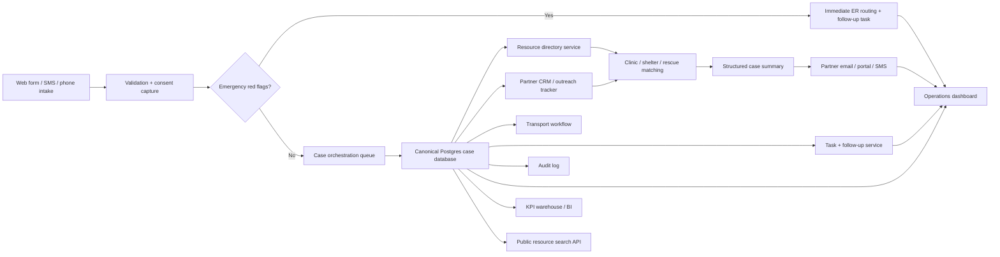
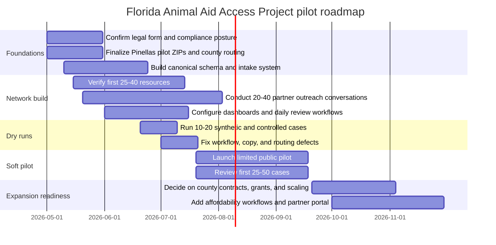

# Florida Animal Aid Access Project Assessment

## Executive summary

The specified GitHub repository is a strong Phase 0 operating-design pack, but it is not yet a software product. It defines a founder-led, legally conservative launch in the default pilot geography of entity["city","Largo","florida"] and entity["place","Pinellas County","florida county"], centered on non-veterinary intake, referral coordination, transport support, case tracking, and follow-up, while explicitly prohibiting diagnosis, prescribing, treatment, animal housing, and fundraising until compliance is handled. That is a sound starting point because it reduces unauthorized-practice and liability risk, but it also means the project still needs a sharper economic mechanism, a real data platform, partner workflows, and a sustainable funding model before it can credibly improve access at scale. fileciteturn6file0L1-L1 fileciteturn7file0L1-L1 fileciteturn10file0L1-L1 fileciteturn11file0L1-L1 fileciteturn20file0L1-L1 fileciteturn22file0L1-L1 fileciteturn0file0

The external market case is real. In nationally representative work from entity["organization","Gallup","polling firm"] and entity["organization","PetSmart Charities","nonprofit grantmaker"], 52% of U.S. pet owners reported skipping or declining needed veterinary care in the prior year; of those declining care due to cost, 73% said they were not offered a lower-priced option, and 23% said they had ever been offered a payment plan. On the provider side, 94% of veterinarians said client finances often or sometimes limit recommended care. Meanwhile, entity["organization","Vetsource","veterinary analytics company"] reported that visits per practice fell 3.1% in 2025 and wellness visits fell 3.8%, even as prices remained elevated; the entity["organization","U.S. Bureau of Labor Statistics","federal labor agency"] shows veterinarian-services inflation still running well above general inflation, with the March 2026 item showing a 5.6% twelve-month increase. citeturn15search2turn15search0turn0search4turn14view0

That combination implies the best business opportunity is not “a better directory.” It is a **care-access orchestration layer** that lowers friction and, where possible, lowers delivered cost: faster emergency routing, verified local options, structured case summaries for clinics and shelters, transport coordination, affordable preventive pathways, pharmacy-routing when lawful, and closed-loop follow-up. The strongest near-term wedge is probably **owner-support and partner-workflow infrastructure** for one county, not statewide consumer expansion, because the repo itself already assumes tight pilot geography, manual review, freshness rules for resources, and low initial case load. fileciteturn8file0L1-L1 fileciteturn16file0L1-L1 fileciteturn20file0L1-L1

My core recommendation is a hybrid operating model: launch with the repo’s conservative service boundary, but add a canonical PostgreSQL-backed case system, a verified resource graph for one county, partner-facing case-summary workflows, and KPI discipline around response times, appointment success, surrender diversion, and affordability outcomes. If executed well, this can become valuable to pet owners, clinics, shelters, rescues, and county agencies simultaneously. The most plausible pilot budgets are roughly **$35k–$60k** for a lean founder-heavy no-code pilot, **$120k–$220k** for a one-county operational pilot with proper staffing and reporting, and **$350k–$650k** for a multi-county build with deeper integrations and sponsored-care funding. Those are modeled planning ranges, not vendor quotes. The medium path is the most defensible. fileciteturn7file0L1-L1 fileciteturn15file0L1-L1 fileciteturn16file0L1-L1

## What the Phase 0 repository already establishes

The repository should be treated as an operations blueprint rather than an MVP codebase. The manifest lists 16 root-level files: 15 Markdown documents plus `manifest.json`. The README calls the folder the first executable document set for launch, and the files cover mission, service boundaries, pilot geography, emergency escalation, triage, intake, case-board schema, resource directory schema, transport, partner outreach, field safety, launch checklist, and agent handoff. There are no executable application files, package manifests, CI workflows, tests, database migrations, notebooks, or deployment configs in the file inventory. fileciteturn6file0L1-L1 fileciteturn7file0L1-L1

The project goals are unusually clear for a phase-0 repo. The mission is to help Florida pets and people reach appropriate help faster through non-veterinary intake, documentation, referral coordination, transport coordination, and follow-up. The doctrine is to become the best coordination layer around existing licensed veterinary and rescue infrastructure before attempting to become any part of that infrastructure. The launch success criteria are operational rather than brand-oriented: identify emergency cases, route them fast, summarize non-emergency cases cleanly, match to local resources, coordinate safe non-medical transport, track outcomes, and avoid unauthorized veterinary practice. fileciteturn9file0L1-L1 fileciteturn22file0L1-L1

The repository’s highest-value product asset is its data model, even though that model is only expressed in Markdown. The intake spec maps submissions into People, Animals, Cases, Media/Documents, Consent, and Follow-Up records. The case board schema adds statuses, triage levels, referrals, follow-ups, and an audit log. The resource directory schema adds verification dates, urgency acceptance, species coverage, payment options, sponsored-care rules, and stale-data rules. The outreach tracker creates the beginning of a CRM for clinics, shelters, rescues, TNR groups, transporters, and social-service partners. In other words, the repo already implies a usable system-of-record design for an access-to-care business. fileciteturn14file0L1-L1 fileciteturn15file0L1-L1 fileciteturn16file0L1-L1 fileciteturn18file0L1-L1

### Repository file inventory

The table below condenses the repo into business-relevant components. It is derived directly from the manifest and project index. fileciteturn6file0L1-L1 fileciteturn8file0L1-L1

| File group | Files | Why it matters |
|---|---|---|
| Governance and positioning | `README.md`, `01_MISSION.md`, `02_SERVICE_BOUNDARY_POLICY.md`, `AGENTS.md` | Defines service posture, legal membrane, and founder-operating doctrine |
| Geography and launch control | `03_PILOT_ZONE.md`, `12_LAUNCH_CHECKLIST.md` | Keeps expansion disciplined and county-specific |
| Safety and triage | `04_EMERGENCY_ESCALATION_POLICY.md`, `05_TRIAGE_LEVELS.md`, `11_FIELD_SAFETY_CHECKLIST.md`, `09_TRANSPORT_PROTOCOL.md` | Reduces delay, transport, and field-liability risk |
| Data capture | `06_INTAKE_FORM_SPEC.md` | Defines structured intake and disclaimers |
| Operations system design | `07_CASE_BOARD_SCHEMA.md`, `08_RESOURCE_DIRECTORY_SCHEMA.md`, `10_PARTNER_OUTREACH_TRACKER_SCHEMA.md` | Defines the future relational backbone |
| Delivery handoff | `13_AGENT_HANDOFF_PROMPT.md`, `manifest.json` | Supports downstream build work and phase continuity |

### Datasets and schemas already present

The repo contains **schemas and specifications**, not live datasets. That distinction matters: there is no evidence of populated resources, real case history, actual partner CRM entries, or validated county routing tables yet. The current “data found” is design data only. fileciteturn11file0L1-L1 fileciteturn15file0L1-L1 fileciteturn16file0L1-L1

| Dataset / table | Core attributes | Source in repo | Operational value | Data sensitivity |
|---|---|---|---|---|
| People | name, contact, ZIP, county, transport access, consent | Intake + case board | Contact and follow-up | High |
| Animals | species, age, sex, weight, vaccine/microchip status, ownership status | Intake + case board | Routing and risk assessment | High |
| Cases | status, triage level, concern, red flags, cost barrier, next action, outcome | Intake + case board | Primary work queue | High |
| Referrals | destination org, referral type, response, appointment status | Case board | Partner outcomes | Medium |
| Follow-Ups | due date, method, result, next step | Case board | Quality control | Medium |
| Audit log | timestamp, actor, before/after values | Case board | Compliance and incident review | Medium |
| Organizations | type, service area, hours, acceptance criteria, payment options, last verified date | Resource directory | Match engine | Low to medium |
| Outreach targets | contact role, workflow notes, sponsored-care openness | Outreach schema | Partner development | Medium |
| Transport records | destination, consent, restraint, incident, cleaning | Transport protocol | Safety and liability | High |

### Representative schema fragments

These are not executable files in the repo today; they are faithful abstractions of the Markdown schema specifications and should become actual tables or Pydantic models in Phase 1. fileciteturn15file0L1-L1 fileciteturn16file0L1-L1

```json
{
  "case_id": "FAAA-0001",
  "status": "Needs review",
  "triage_level": "Level 2",
  "requester_id": "P-104",
  "animal_id": "A-104",
  "county": "Pinellas",
  "zip": "33771",
  "main_concern": "Needs low-cost same-week visit",
  "red_flags_present": false,
  "transport_needed": "limited",
  "cost_barrier": "yes",
  "consent_to_share": true,
  "next_action": "Route to low-cost clinic options",
  "next_action_due": "2026-05-01T17:00:00-04:00"
}
```

```sql
organizations(
  organization_id,
  name,
  org_type,
  county,
  service_area,
  emergency_status,
  species_accepted,
  accepts_new_clients,
  accepts_urgent_cases,
  payment_options,
  sponsored_care_allowed,
  intake_requirements,
  last_verified_at,
  status
);
```

## Florida market and operating context

The market logic is strong because both demand pressure and service friction are visible. The entity["organization","American Veterinary Medical Association","us veterinary association"] reported that in 2024, 45.5% of U.S. households owned dogs and 32.1% owned cats, with average annual veterinary spending of $580 for dog-owning households and $433 for cat-owning households. The entity["organization","American Pet Products Association","trade association"] reported $41.0 billion in U.S. veterinary care and product sales in 2025 and projected $42.4 billion for 2026. That is a large, resilient category, but not one in which affordability is solved. citeturn1search0turn1search5

The pressure is especially relevant in the pilot county. The entity["organization","U.S. Census Bureau","federal statistics agency"] reports that entity["place","Pinellas County","florida county"] had 428,473 households in 2020–2024, median household income of $72,646, poverty of 10.8%, a senior share of 27.5%, disability under 65 of 10.3%, and 15.9% of residents speaking a language other than English at home. Broader hardship is even larger than poverty alone: entity["organization","United For ALICE","financial hardship research"] reports 47% of Florida households below the ALICE threshold in 2023, and a regional workforce plan citing county snapshots places Pinellas at 36% ALICE plus 12% in poverty. That profile supports a business focused on coordination, transport, affordability navigation, and senior-friendly workflows. citeturn3search2turn3search0turn5search5turn5search35

Affordability is not the only barrier. The 2025 Gallup/PetSmart owner study found 52% of pet owners had skipped or declined care in the prior year, while the 2026 veterinarian study found 94% of vets said client finances limit care. At the same time, a 2024 original research paper on Colorado access-to-care challenges found a dual problem: in a representative survey, the most common barriers were no nearby appointments and clinic hours that did not work, while affordability dominated among more directly impacted in-person respondents; emergency care was the most common type of care people were trying to obtain. The lesson is that this project should not define the problem narrowly as “cheap care.” It is **affordability plus appointment access plus logistics plus communication**. citeturn15search2turn15search0turn29search1turn29search3turn29search0

The local ecosystem is sufficiently dense to support the repo’s coordination thesis, but it is fragmented across public, nonprofit, and private channels. The official community-resource page from entity["organization","Pinellas County Animal Services","county shelter agency"] already points owners to pet-food help, reduced-cost providers, rehoming support, and community-cat resources, naming entity["organization","SPCA Tampa Bay","animal welfare nonprofit"], entity["organization","Humane Society of Pinellas","animal welfare nonprofit"], entity["organization","Operation:SNIP","Largo clinic"], entity["organization","SPOT Low Cost Spay & Neuter Clinic","Pinellas Park clinic"], and entity["organization","Friends of Strays","animal welfare nonprofit"] as part of the landscape. Official or provider sites also show 24/7 emergency capacity from entity["company","BluePearl Pet Hospital","specialty vet company"] in Clearwater, entity["company","Veterinary Emergency Group","emergency vet company"] in Clearwater, and entity["organization","Beacon Emergency Veterinary Hospital","St Petersburg ER"] in St. Petersburg, while mobile/house-call options exist through practices such as entity["organization","Pinellas Pet Wellness","mobile veterinary practice"]. That density is promising, but it increases the need for verified routing rules, referral formatting, and freshness controls. citeturn23search0turn25search5turn22search1turn22search6turn23search2turn23search3turn25search0turn24search4turn24search0turn24search3turn24search6

### What the local landscape implies

| Market attribute | Evidence | Business implication |
|---|---|---|
| Large care-seeking base | High household count in Pinellas; large national pet-owning base | Enough demand for a county pilot |
| Affordability pressure | High skipped-care rates; ALICE hardship; elevated vet inflation | Need cost-aware routing and financing workflows |
| Service fragmentation | Public shelters, nonprofits, low-cost clinics, mobile care, ER hospitals, TNR | Directory alone is not enough; orchestration matters |
| Emergency sensitivity | Repo red-flag logic plus dense ER network | Intake must separate emergency from routine immediately |
| County-by-county operational variance | Repo requires jurisdiction mapping and verified shelter/animal-control routing | Statewide launch would be premature |

The strongest opportunity, therefore, is to create a **county-specific, verified, case-based access engine** rather than a generic statewide pet-help website. The moat would be not just software, but a living combination of verified local resource data, partner workflow knowledge, response and outcome data, and disciplined case summaries that reduce front-desk burden for clinics and shelters. That is much harder to replicate than a static directory. fileciteturn11file0L1-L1 fileciteturn16file0L1-L1 fileciteturn18file0L1-L1

## Business model, stakeholders, regulation, and funding

### Stakeholder analysis

The project sits at the intersection of pet care, social services, shelter diversion, and public trust. The table below reflects the highest-priority stakeholders given the repo and the Florida access-to-care evidence. fileciteturn9file0L1-L1 fileciteturn18file0L1-L1 citeturn15search2turn15search0turn29search1

| Stakeholder | Primary pain | What they value | Risk if ignored | Recommended engagement |
|---|---|---|---|---|
| Owners and finders | Confusion, cost shock, transport gaps, no-shows | Fast answers, clear next steps, lower-friction options | Low completion, bad outcomes, mistrust | Text-first intake, structured follow-up, affordability routing |
| General-practice clinics | Front-desk overload, incomplete histories, non-fit referrals | Better summaries, fewer dead-end calls, lower admin time | Partners disengage | Partner-specific intake templates and case-brief handoffs |
| Emergency hospitals | Delay caused by non-medical intake | Immediate escalation and clean routing | Safety liability | ZIP-based ER routing and no-delay policy |
| Shelters/rescues/TNR groups | Capacity limits, poor intake fit, surrender pressure | Better pre-screening, diversion, and documentation | Rejection loops, poor public experience | Workflow mapping and referral filters |
| County agencies | Public-health and stray-routing obligations | Correct jurisdiction routing, bite/rabies handling, shelter diversion | Operational conflict | County-specific rules and shared metrics |
| Funders and grantmakers | Need measurable animal and family outcomes | Credible KPIs and compliance | Weak fundraising case | Outcome dashboard and audited case data |

The business model should reflect the fact that the end consumer is price constrained. Direct B2C monetization at launch is therefore the weakest option. A more plausible early model is a mix of county or nonprofit service agreements, restricted program grants, and later, if legally structured, sponsored-care administration or employer/community referral partnerships. Clinics and shelters benefit because the project can remove triage and navigation labor that their staff currently absorb without reimbursement. Owners benefit because they get a trusted, local, step-by-step pathway rather than a search problem. citeturn15search2turn15search0turn5search35

### Regulatory landscape in Florida

The repo’s non-veterinary boundaries are well chosen because Florida law reserves telehealth diagnosis, treatment, and prescribing to licensed veterinarians within a veterinarian-client-patient relationship. The 2025 Florida statute on veterinary telehealth allows a Florida-licensed veterinarian to practice telehealth and even establish a VCPR by synchronous audiovisual evaluation, but it also limits telehealth-only prescribing for animal-labeled drugs and prohibits certain human-use and compounded anti-infectives absent an in-person exam or premises visit. The repo’s insistence on “we are not a veterinary clinic” is therefore not just cautious language; it is the correct launch posture. fileciteturn10file0L1-L1 citeturn16search0turn16search6

Florida’s prescription environment is also moving toward more client choice. Senate materials for 2026 bill summaries show that CS/CS/HB 89 on veterinary prescription disclosure passed both chambers unanimously and would require client disclosure of the right to receive a written prescription and use a pharmacy of choice, with a stated July 1, 2026 effective date if approved by the Governor or allowed to become law without signature. Because the indexed official pages surfaced here still showed “ordered enrolled” rather than a codified effective statute, I treat this as **imminent but not fully verified as operative**. Strategically, however, it supports building lawful pharmacy-routing features and price-comparison education into a future version of the project. citeturn18search3turn20search0turn20search1

Public-health routing matters too. The entity["organization","Florida Department of Health","state health agency"] states that rabies is nearly always fatal once illness appears, that unvaccinated pets can become a major household risk, that outside cats are the most common domestic animals found with rabies in Florida, and that dogs, cats, and ferrets are required by Florida law to be vaccinated. This supports the repo’s emergency and field-safety emphasis and suggests the platform should explicitly surface bite, exposure, stray, and quarantine routing pathways rather than treating all help requests as equivalent. citeturn26search0turn26search2

Fundraising is a compliance issue, not just a growth tactic. The repo repeatedly says “do not solicit donations until compliance is resolved,” and Florida statute 496.405 requires most charitable organizations that intend to solicit contributions in or from the state to register before doing so. For that reason, the recommended initial operating form is either a for-profit service business with clear boundaries or a nonprofit/charitable structure that completes registration before any public asks. Launching with donation buttons before that step would be an avoidable own goal. fileciteturn7file0L1-L1 fileciteturn20file0L1-L1 citeturn28search8turn28search2

### Funding landscape

The most Florida-specific grant source identified in this research is entity["organization","Florida Animal Friend","spay neuter grantmaker"]. It awards up to $25,000 per organization annually for free or low-cost spay/neuter programs, is funded through the specialty plate program, and requires that eligible nonprofit applicants have 501(c)(3) status and be registered with the Florida Department of Agriculture and Consumer Services. The limitation is important: those funds are tightly tied to sterilization goals and generally do not cover capital costs, transportation, or generalized navigation operations. That makes them ideal for a later preventive-care or community-cat module, but not for the entire operating model. citeturn27search0turn27search1turn27search3turn27search7

Nationally, entity["organization","Maddie's Fund","animal welfare funder"] remains relevant because it has committed more than $301.3 million historically and now foregrounds access to veterinary and behavior care as a way to keep pets and people together. That does not mean funding is guaranteed, but it does mean the project would fit a current philanthropic narrative if it can show clear owner-support, access-to-care, and shelter-diversion outcomes. citeturn27search6turn27search8

## Data, systems, and technical architecture

The repo’s own immediate stack suggestion leans heavily toward forms, Airtable, Google Voice, Google Drive, and later automation. That is sensible for speed, but a pure no-code approach will become fragile once the project needs auditability, deduplication, partner-specific workflows, analytics, and county-by-county expansion. The right compromise is a **hybrid architecture**: keep low-friction intake, but create a canonical relational backend from the beginning. fileciteturn7file0L1-L1 fileciteturn15file0L1-L1 fileciteturn16file0L1-L1

### Recommended stack comparison

| Stack option | Components | Best for | Advantages | Drawbacks | Recommendation |
|---|---|---|---|---|---|
| Lean no-code | Tally/Jotform, Airtable, Google Voice, Google Drive, Looker Studio | 30-day pilot | Fastest, cheapest, easy to operate | Weak audit trail, schema drift, limited APIs | Good for dry runs only |
| **Recommended hybrid** | Next.js or simple static site, Supabase/Postgres, object storage, n8n, Twilio, Metabase | 6–18 month pilot | Structured data, APIs, RBAC, portability, analytics | More setup discipline required | **Best fit** |
| Heavy enterprise | Custom app, dedicated CRM, HL7/FHIR-adjacent integrations, BI warehouse | Multi-county/state scale | Powerful, extensible, partner-grade | Too expensive and premature | Not yet |

### Recommended system architecture

The diagram below operationalizes the repo’s schemas, legal boundaries, and county-first workflow. It assumes a public intake layer, rules-based red-flag engine, human review for non-emergency cases, and a canonical case database with dashboards and API outputs.



The primary dependencies should be lightweight and legible: PostgreSQL, object storage, Twilio or an equivalent messaging provider, a forms layer, a rules engine for emergency flags, and a dashboard tool. No AI triage should be used to decide whether a condition is medically safe to wait; the repo’s own documents are right to keep emergency logic factual and conservative. The most appropriate use of AI, if added later, would be case-summary drafting, directory normalization, duplicate detection, and operator assistance—not autonomous medical advice. fileciteturn12file0L1-L1 fileciteturn13file0L1-L1

### Dataset implementation priorities

| Priority | Dataset | Why first | Phase 1 deliverable |
|---|---|---|---|
| Highest | Cases, People, Animals, Consents | Core operating record and legal basis for sharing | Working case system |
| High | Resource directory | Matching accuracy is the service’s core value | Verified county resource graph |
| High | Follow-Ups + audit log | Outcome visibility and safe scaling | Daily queue review |
| Medium | Referral records | Needed for partner ROI and KPI reporting | Closed-loop outcome capture |
| Medium | Outreach targets | Builds partner network and sponsor pipeline | Partner CRM |
| Medium | Transport records | Safety, incidents, and route economics | Driver protocol and metrics |
| Later | Public API/search index | Supports self-service and future apps | Read-only resource search |

## KPIs, roadmap, budget, risks, and partners

### KPIs

The KPI system should focus less on vanity metrics and more on measurable reductions in delay, friction, and avoidable surrender. The repo already implies many of these fields. fileciteturn8file0L1-L1 fileciteturn15file0L1-L1 fileciteturn16file0L1-L1

| KPI | Why it matters | First-year target |
|---|---|---|
| Median intake-to-first-response time | Core service speed | < 15 minutes during staffed hours |
| Level 0 emergency escalation time | Safety-critical | < 5 minutes from red-flag detection |
| Resource verification freshness | Directory trust | 95% of active ER resources < 30 days old |
| Appointment secured rate | Outcome, not activity | 35%–50% of non-emergency eligible cases |
| Successful referral completion rate | Closed-loop value | 60%+ of referred cases with known outcome |
| Surrender-diversion rate | Shelter-system benefit | 15%–25% of intake cases at risk of surrender |
| Transport completion rate | Logistics value | 80%+ for accepted transport cases |
| Follow-up completion rate | Quality/control | 90%+ of due follow-ups completed on time |
| Re-open rate within 14 days | Routing quality | < 15% |
| Partner response SLA | Network health | 70%+ of active partners reply within agreed window |
| Estimated owner cost savings per closed case | Economic mechanism | Establish baseline, then improve quarterly |
| Net promoter / trust score | User retention and referrals | 50+ after pilot stabilization |

### Implementation roadmap

The roadmap below assumes the repo’s default pilot geography remains in place and that no medical services or public fundraising are launched until compliance is complete. fileciteturn11file0L1-L1 fileciteturn20file0L1-L1



### Budget estimates

These are **modeled planning estimates** based on the repo’s founder-led launch assumptions, one-county scope, no clinic or shelter facility, and an early emphasis on coordination rather than medical service delivery. They are meant for budgeting discipline, not procurement. fileciteturn7file0L1-L1 fileciteturn9file0L1-L1 fileciteturn20file0L1-L1

| Budget line item | Low | Medium | High |
|---|---:|---:|---:|
| Forms, database, storage, dashboard, telephony | $3k | $8k | $20k |
| Website and product build | $5k | $25k | $100k |
| Legal, compliance, entity setup, policy review | $5k | $12k | $30k |
| Insurance | $2k | $5k | $15k |
| Founder stipend / operations lead | $0–$12k | $45k–$70k | $80k–$120k |
| Additional coordinator / case support | $0 | $35k–$60k | $90k–$140k |
| Data / analytics / engineering contractor | $5k | $20k | $80k |
| Partner outreach and field ops | $3k | $10k | $35k |
| Devices, PPE, transport kit, misc. equipment | $2k | $5k | $15k |
| Evaluation, reporting, and contingency | $5k | $15k | $45k |
| **Estimated total** | **$35k–$60k** | **$120k–$220k** | **$350k–$650k** |

The medium budget is the best balance of credibility and control. The low budget can prove workflow feasibility but will struggle to deliver robust analytics, partner response discipline, or sustained county-level impact. The high budget only makes sense after one-county evidence shows repeatable gains in access, affordability, or surrender diversion. citeturn15search2turn15search0turn29search1

### Recommended partners

The first wave of partner targets should be the organizations that already reveal key access pathways in the county: entity["organization","Pinellas County Animal Services","county shelter agency"] for jurisdictional routing; entity["organization","Humane Society of Pinellas","animal welfare nonprofit"] and entity["organization","SPCA Tampa Bay","animal welfare nonprofit"] for shelter diversion and owner-help resources; entity["organization","Operation:SNIP","Largo clinic"] and entity["organization","SPOT Low Cost Spay & Neuter Clinic","Pinellas Park clinic"] for preventive and lower-cost pathways; entity["organization","Friends of Strays","animal welfare nonprofit"] for community-cat/TNVR routing; and emergency partners such as entity["company","BluePearl Pet Hospital","specialty vet company"], entity["company","Veterinary Emergency Group","emergency vet company"], and entity["organization","Beacon Emergency Veterinary Hospital","St Petersburg ER"] for no-delay escalation. Longer-term funding and innovation conversations should prioritize entity["organization","Florida Animal Friend","spay neuter grantmaker"] and entity["organization","Maddie's Fund","animal welfare funder"]. citeturn23search0turn22search0turn22search1turn22search6turn23search2turn23search3turn25search0turn24search4turn24search0turn24search3turn27search0turn27search6

### Main risks and mitigation

| Risk | Why it matters | Mitigation |
|---|---|---|
| Scope creep into veterinary practice | Could create regulatory exposure | Keep public copy and operator scripts aligned with repo boundary policy |
| County-wide demand outpaces founder capacity | Slow responses destroy trust | Maintain pilot caps and staffed-hour expectations |
| Directory staleness | Wrong referrals create harm | Enforce freshness SLAs by resource type |
| Weak partner adoption | No closed-loop outcomes | Build partner-specific workflows, not generic referral blasts |
| No durable economic mechanism | Directory becomes charity-like overhead | Track owner cost savings, surrender diversion, and staff-time savings for partners |
| Data privacy and consent failures | Sensitive owner/pet data | Role-based access, explicit share consent, audit logs |
| Funding before compliance | Legal and reputational risk | Do not solicit public donations until registration is complete |
| Over-automation of triage | Safety risk | Use human review for non-emergency routing; never automate medical advice |

## Open questions and limitations

This report is high-confidence on the repo’s contents, the broad access-to-care problem, the local Pinellas ecosystem, and the core technical/business recommendations. Several items remain unresolved because they were not specified or were not fully verifiable from the source set returned here.

The first limitation is legal-operational specificity. The repo defaults to Largo/Pinellas, but the user explicitly said target counties are unspecified; I therefore treated the repo default geography as a working assumption rather than a locked commitment. If the pilot county changes, the resource graph, transport economics, partner mix, and KPI baselines will change materially. fileciteturn11file0L1-L1

The second limitation is legislative status. Florida’s 2026 veterinary prescription-disclosure bill appears to have passed both chambers and is described in official Senate summaries as taking effect July 1, 2026 if approved or allowed to become law, but the indexed legislative pages surfaced in this research still showed “ordered enrolled.” I therefore treated the measure as pending/imminent rather than definitively active. citeturn18search3turn20search0turn20search1

The third limitation is economics. I did not validate current 2026 vendor pricing for every recommended software component, and the budget figures are modeled estimates rather than procurement quotes. They are appropriate for planning and investor/operator discussion, but not for contracting without a pricing pass.

The fourth limitation is software readiness. There is currently no executable application code in the repo. Phase 1 is therefore not optimization of an existing system; it is a greenfield build from a strong operating specification. That is manageable, but it means timelines depend heavily on founder bandwidth and the quality of the first implementation partner. fileciteturn6file0L1-L1 fileciteturn22file0L1-L1